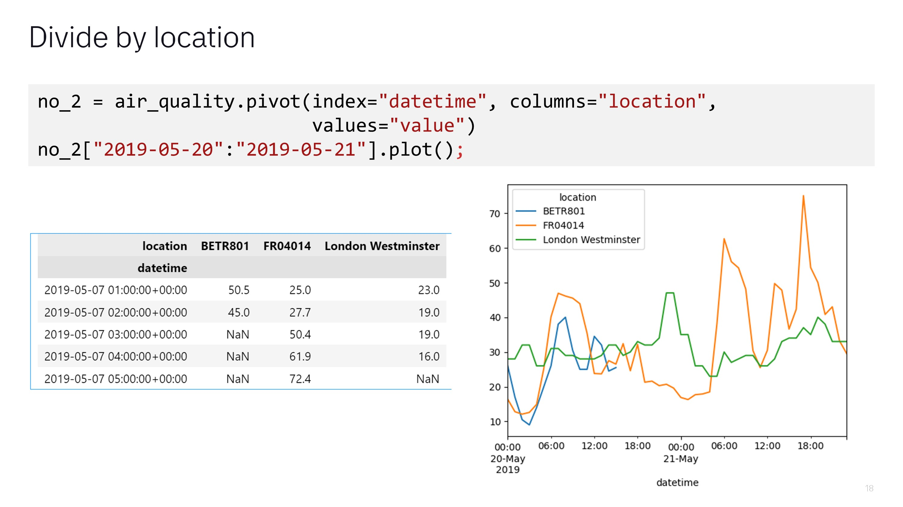
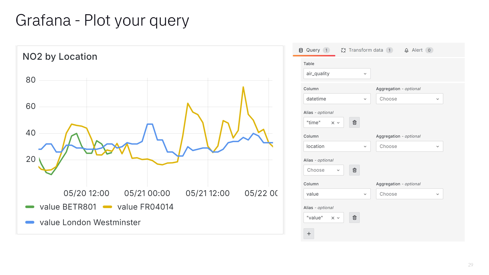

# Intro
Code samples and materials 💾 from talk 💬 on March 2024 [Beer & Data (🍺&📈) meetup](https://www.meetup.com/beer-data/)
  
# Data Source and Pandas example workflow
Data showing typical Pandas workflow are from official [Pandas tutorial](https://pandas.pydata.org/docs/getting_started/intro_tutorials/09_timeseries.html).  
They use air quality data made available by [OpenAQ](https://openaq.org/) and downloaded using the py-openaq package.  
Images generated by Copilot Designer
  
# Slides

